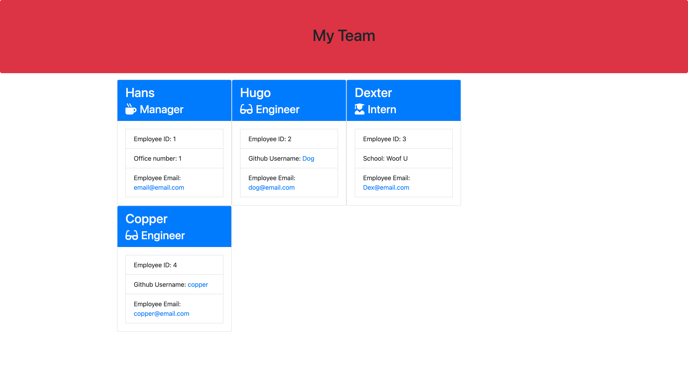

# Team-Profile-Generator

A Node command-line application that takes in information about employees on a software engineering team and generates an HTML webpage that displays summaries for each person.

[REPOSITORY](https://github.com/Hreichgelt/Team-Profile-Generator)

## TABLE OF CONTENTS

1. [Description](#description)
2. [Usage](#USAGE)
3. [Visuals](#visuals)
4. [Authors Acknowledgments](#authors-and-acknowledgments)
5. [Resources](#resources)

## DESCRIPTION

Easily enter your teams information and answer prompts to generate a nice team layout webpage.

## USAGE

Upon initializing the app, follow the prompts, add all members of your team and their information and the application will generate a nice looking html webpage for you.

## VISUALS

## AUTHORS AND ACKNOWLEDGMENTS

## RESOURCES

1. [REPOSITORY](https://github.com/Hreichgelt/Team-Profile-Generator)
